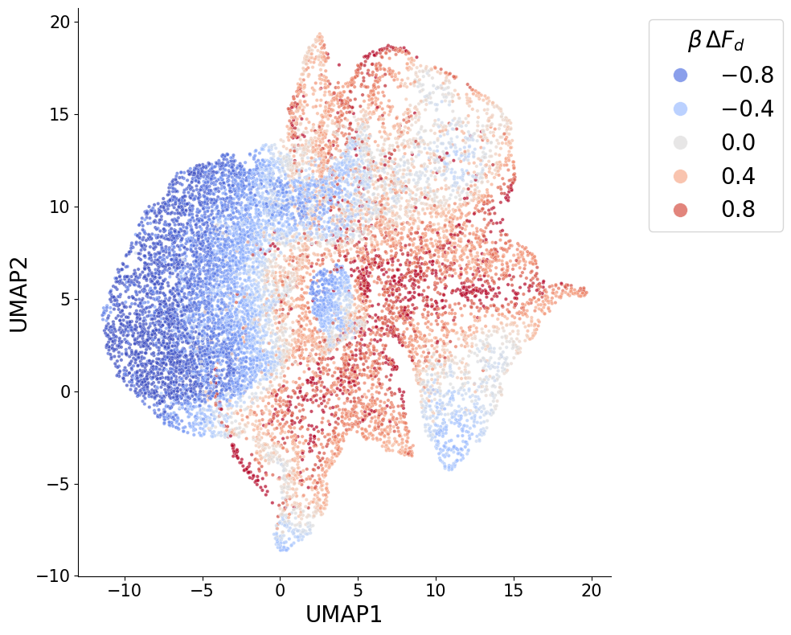

# Microscopy analysis workflows

A visual, notebook-based guide to quantitative microscopy image analysis—from
raw images and metadata to segmented objects, interpretable measurements,
learned representations and analysis-ready tables.


## Follow the workflow

The notebooks are ordered so that every stage introduces one methodological
decision, shows the corresponding Python interface and then presents a
representative visual result.

| Notebook | Focus | Result |
| --- | --- | --- |
| `00_workflow_overview.ipynb` | Analysis design and data flow | End-to-end map |
| `01_images_and_segmentation.ipynb` | Image inspection and 2D/3D segmentation | Label progression |
| `02_object_and_radial_features.ipynb` | Morphology, intensity, texture and radial measurements | Feature interpretation |
| `03_spatial_graphs.ipynb` | Dense-region graphs and temporal node tracking | Spatial representation |
| `04_vae_representations.ipynb` | VAE/CVAE embeddings of nuclear crops | Latent embedding |
| `05_feature_tables_and_figures.ipynb` | Filtering, joins and condition-level analysis | Heatmaps and classification |

Start with [the workflow overview](notebooks/00_workflow_overview.ipynb).

## Method families

- Confocal stacks, multichannel fluorescence, RGB and brightfield inputs
- StarDist and threshold-based nucleus segmentation
- Two- and three-dimensional morphology and intensity measurements
- Texture, boundary curvature and nuclear/spheroid radial profiles
- Graph representations of dense intranuclear regions
- VAE and conditional VAE image embeddings
- Feature-table filtering, correlation pruning, clustering and visualization

All geometric thresholds in the examples are explicit pixel values. Adjust them
in the JSON configuration files to match the image scale and assay.

## Installation

Clone the workflow and method repositories into the same parent directory, then
install them in editable mode:

```bash
python -m pip install -e ../nuclear-imaging-core
python -m pip install -e ../nuclear-table-tools
python -m pip install -e ../nuclear-spheroid-analysis
python -m pip install -e ../nuclear-vae-embeddings
python -m pip install -e .
```

Open the notebooks with JupyterLab:

```bash
jupyter lab notebooks/
```

## Example results

| Segmentation | Feature-space structure |
| --- | --- |
|  |  |

The method packages can also be used independently in experiment-specific
scripts and notebooks.
